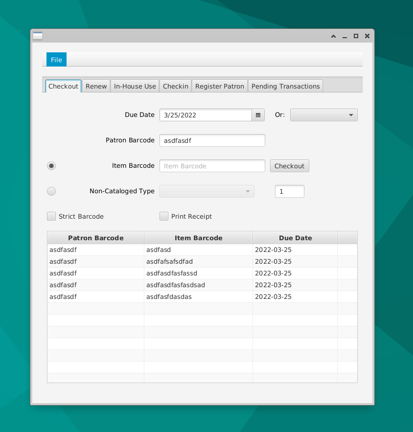
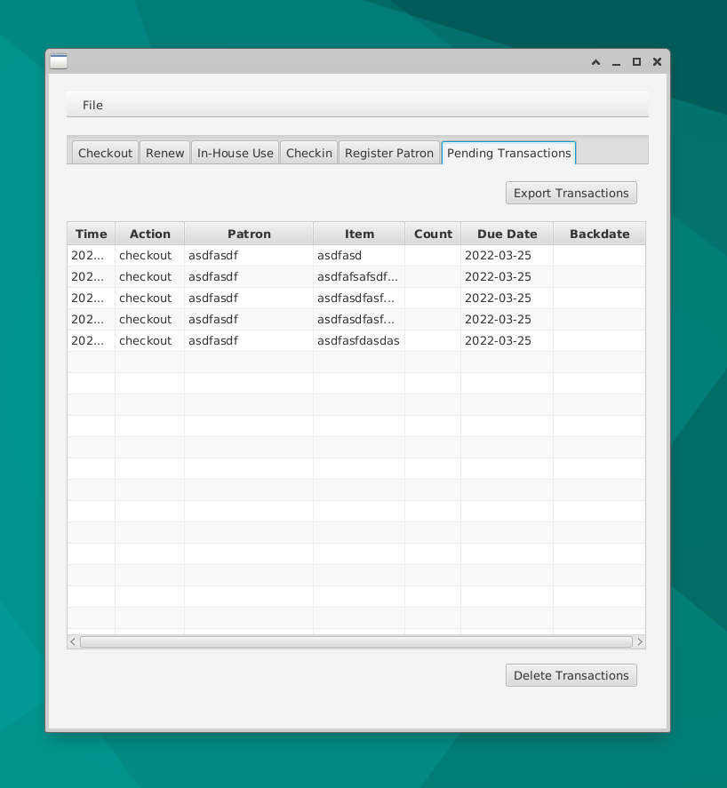

# eg-offline-jfx

Evergreen Offline UI in Java / JavaFX

## Running From Source (Ubuntu Version)

```sh
sudo apt install openjdk-11-jdk libopenjfx-java maven

git clone github.com:berick/eg-offline-jfx

cd eg-offline-jfx

mvn javafx:run

```

## Screens

### Checkout Tab



### Pending Transactions Tab




## Java with Local Certificate

https://medium.com/expedia-group-tech/how-to-import-public-certificates-into-javas-truststore-from-a-browser-a35e49a806dc


```sh
# Roughly...
keytool -keystore /etc/ssl/certs/java/cacerts -import -alias Chomp.dev -file /path/to/my/cert.cer
```
